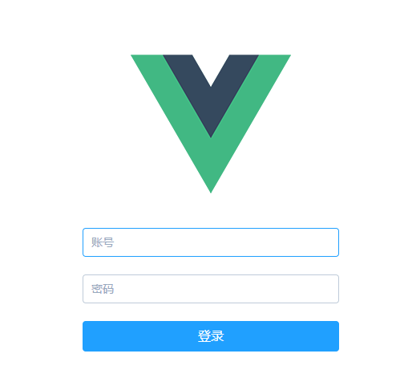

# vue-create-packages

> Vue技术生态圈项目创建脚手架工具

## Build Setup

``` bash
# install dependencies
npm install

# serve with hot reload at localhost:8084
npm run compile:dev (本地运行环境~)

# build for production with minification(test website)
npm run compile:test (测试环境)

# build for production with minification(online website)
npm run compile:build (线上环境)

# run unit tests
npm run unit (单元测试)

# run e2e tests
npm run e2e (集成测试)

# run all tests
npm test (所有测试)
```

## Backend Server API HOST CONFIG
``` bash
1. directory url： 'src/config/envconf.js'
#其中区分出不同的环境后端服务接口地址和静态图片服务地址(如果有的话)

2. fetch api url Tool:
#目前只简单写了一个简单的fetch方法,你也可以调用第三方库进行封装，比如axios.由项目人员自己决定

```

## 目录结构
```
├── build #项目编译文件
├── docs #文档目录
├── config #不同环境基本配置文件
├── dist #生产环境目录
├── src #源码目录
│   ├── javascript #js相关内容路径
│   │   ├── components #React组件相关内容
│   │   ├── data #页面内需要用的数据，为json文件
│   │   ├── extend #公共函数，包括util工具类，登录，配置文件等
│   │   ├── page #页面对应的jsx文件
│   │   └── states #一些页面要用的数据
│   ├── assets #资源目录
│   │   ├── img  #图片目录
│   │   ├── fonts #字体目录
│   │   ├── ....
│   │── components #组件目录
│   ├── config # 数据获取配置文件、
│   │   ├── envconf.js #不同环境后端服务接口地址
│   │   ├── fetch.js #获取数据公用封装方法
│   │   ├── rem.js #如果是移动端计算响应样式
│   │── data #配置数据资源
│   │── page #业务页面
│   │   ├── vueTpl.vue #PC端页面模板
│   │   ├── login.vue #PC端登录页面模板
│   │   ├── Hello.vue #PC端首页如有入口
│   │   ├── home.vue #PC端欢迎页面.
│   │── router #路由管理
│   │── service #接口统一请求管理
│   │── store #Vue 状态管理
│   │── style #样式管理
│   │── extend #各个工具类
│   │   ├── common #公用工具类
│   │   │   ├──Utils.js #基本工具类
│   │   │   ├──HistoryUtil.js #浏览历史工具类
│   │   │   ├──DateUtil.js #时间处理工具类
│   │   │   ├──CookieUtil.js #缓存处理工具类
│   │   │   ├──...................................

├── App.vue #入口页面加载模板(包含第一层路由，注意路由可以嵌套)
├── main.js #入口页面
├── .babelrc #babel 转化配置文件
├── .eslintignore #eslint 检测忽略文件
├── .eslintrc.js #eslint相关配置
├── .gitignore  #git 忽略文件目录
├── .postcssrc.js  #postcss 配置
└── README.md 说明文件

```

## 系统初始化说明
1.简单的登录界面地址：http://172.16.16.111:8084/#/



2. 再登录页面直接点击"登录"按钮，进入到首页.


3. 增加后台业务页面地址:
在src/page下增加相应的页面业务逻辑代码,模板文件参考src/page/vueTpl.vue
同时在src/page/Hello.vue 文件中增加相应的功能模块菜单

其中 配置的router参数用法: 是否使用 vue-router 的模式，启用该模式会在激活导航时以 index 作为 path 进行路由跳转


## 技术栈简要说明(基于Vue-cli)
1. 业务框架: vue,vuex,vue-router,element-ui
2. 工程框架: webpack, babel, eslint, postcss, test相关.(后续实践补充~)